# TrackVim — SaaS Billing System Documentation

This document explains the complete gym subscription billing flow: trial → first invoice → payment → monthly recurring → overdue/suspension → cancellation/reactivation → plan changes. It covers **which triggers fire automatically**, **which RPCs are called explicitly**, and **which crons run on a schedule**.

---

## 1. Mental model: Trigger vs RPC vs Cron

| Type        | Who calls it                                  | Example                                                          |
| ----------- | --------------------------------------------- | ---------------------------------------------------------------- |
| **Trigger** | Postgres, automatically, on a table event     | `gyms_set_billing_defaults` on `INSERT INTO gyms`                |
| **RPC**     | Application/backend, explicitly               | `change_gym_subscription_plan()` when owner clicks "Change Plan" |
| **Cron**    | `pg_cron` / Supabase scheduler, on a schedule | `generate_first_gym_invoices()` at 02:30 daily                   |

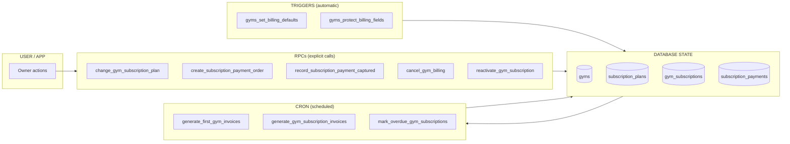

**Triggers protect/set data. RPCs perform business actions. Cron drives time-based billing.**

---

## 2. Schema change: separate `billing_status` from `gyms.status`

This is the key structural change in the current design: **billing state is no longer conflated with application state, and it's no longer inferred from `current_plan_id` being NULL.**

Previously, "billing cancelled" had no clean representation — you'd be tempted to null out `current_plan_id`, which loses the record of what the owner was subscribed to. Instead, `gyms` gets its own billing-specific enum.

```ts
export const gymBillingStatusEnum = pgEnum("gym_billing_status", [
  "Trial",
  "Active",
  "Pending",
  "Suspended",
  "Cancelled",
]);
```

```ts
billingStartDate: date("billing_start_date"),

currentPlanId: uuid("current_plan_id").references(
  () => subscriptionPlans.id,
),

billingStatus: gymBillingStatusEnum("billing_status")
  .notNull()
  .default("Trial"),
```

**`current_plan_id` is never cleared on cancellation** — the plan the owner was on stays on record even while `billing_status = Cancelled`.

The supporting index moves from gym/application status onto billing status:

```ts
index("gyms_billing_status_idx")
  .on(t.billingStatus, t.billingStartDate)
  .where(sql`billing_start_date is not null`),
```

### Three separate concepts, three separate fields

| Field                      | Answers                                         | Owned by                     |
| -------------------------- | ----------------------------------------------- | ---------------------------- |
| `gyms.status`              | Is the gym/application itself operational?      | Application logic            |
| `gyms.billing_status`      | What is the gym's subscription state right now? | Billing system               |
| `gym_subscriptions.status` | What happened to _this one invoice_?            | Individual invoice lifecycle |

Example — a gym can be billing-`Active` even while one invoice sits `Paid` and the next sits `Pending`, because the current invoice isn't overdue yet:

```text
gyms
────────────────────────
billing_status = Active
current_plan_id = Pro

gym_subscriptions
────────────────────────────────
August    Paid
September Pending   ← not yet due, gym stays Active
```

---

## 3. `billing_status` state machine

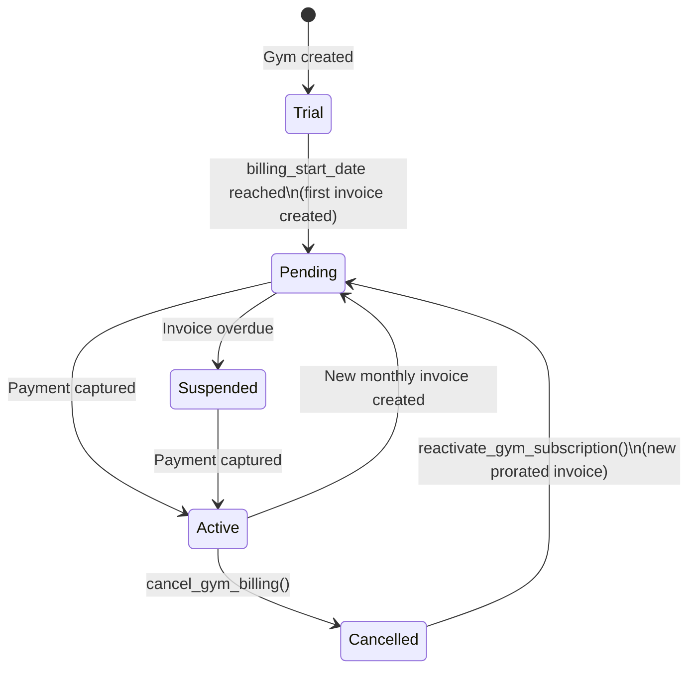

| Transition            | Trigger                                                                      |
| --------------------- | ---------------------------------------------------------------------------- |
| `Trial → Pending`     | Daily 02:30 cron creates the first invoice                                   |
| `Pending → Active`    | Razorpay webhook confirms payment                                            |
| `Active → Pending`    | Monthly cron creates the next invoice                                        |
| `Pending → Suspended` | Daily 04:00 cron finds an overdue invoice                                    |
| `Suspended → Active`  | Owner pays the overdue invoice                                               |
| `Active → Cancelled`  | Owner (or admin) calls `cancel_gym_billing()`                                |
| `Cancelled → Pending` | Owner returns; `reactivate_gym_subscription()` issues a new prorated invoice |

---

## 4. End-to-end lifecycle overview

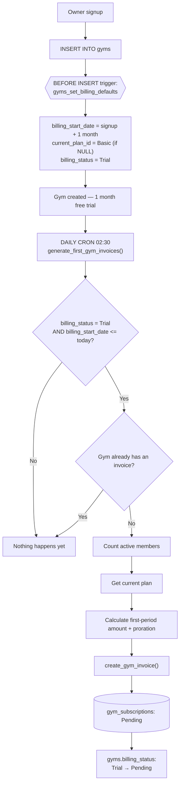

> **Key design change:** there is **no trigger** that creates the first invoice on gym insert anymore. The old trigger `gyms_generate_first_invoice_on_insert` was removed. Instead: `INSERT gym → Trial → daily cron → first invoice → billing_status = Pending`.

---

## 5. Trial flow — owner inactivity, cancellation & reactivation

This traces the trial period through to its outcomes: the owner pays and the gym goes live, or the owner never engages and billing is cancelled — with a path back in later via reactivation.

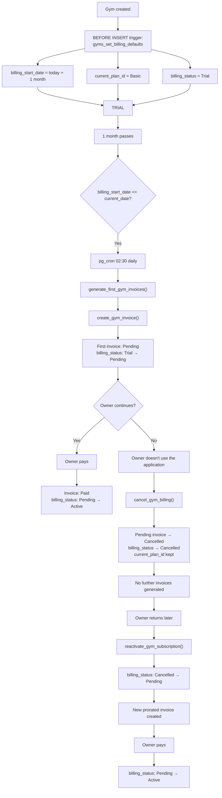

### Notes on this path

- The trial itself needs **no invoice** — `gyms_set_billing_defaults` only stamps `billing_start_date`, the default `Basic` plan, and `billing_status = Trial`; the daily cron is what turns trial-end into an actual Pending invoice.
- If the owner simply goes quiet, TrackVim doesn't chase the invoice through Overdue/Suspended forever — inactivity is resolved by calling `cancel_gym_billing()`, which cancels the outstanding Pending invoice and sets `billing_status = Cancelled` directly. **`current_plan_id` is preserved.**
- Once `Cancelled`, the monthly cron (`generate_gym_subscription_invoices()`) has nothing to act on for that gym.
- Coming back goes through `reactivate_gym_subscription()`: `billing_status` moves `Cancelled → Pending` and a **new prorated invoice** is created reflecting the current plan and today's date, rather than resurrecting the old `billing_start_date`. `billing_status` only reaches `Active` again once that invoice is paid.

---

## 6. First invoice generation (daily cron, 02:30)

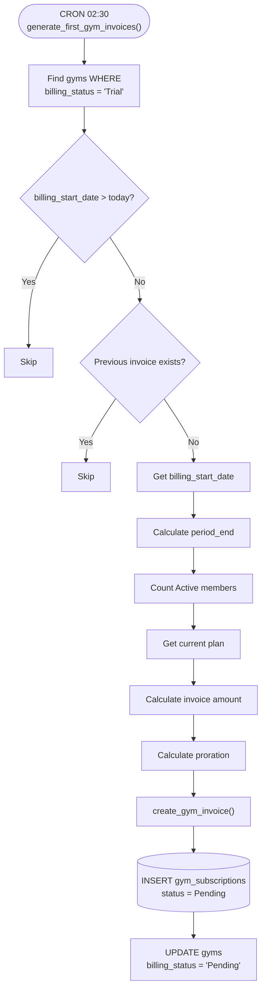

---

## 7. Monthly recurring invoices (cron, 1st of month 03:00)

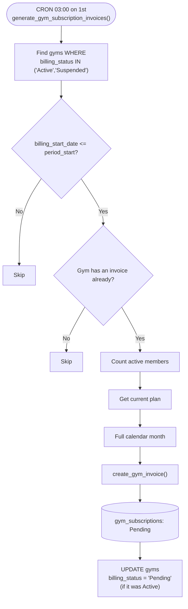

**Division of responsibility:**

- `generate_first_gym_invoices()` → gyms with `billing_status = 'Trial'`, creates the **first** invoice, flips to `Pending`
- `generate_gym_subscription_invoices()` → gyms already billing (`Active`/`Suspended`), creates **all future** monthly invoices

Both ultimately call the shared `create_gym_invoice()` RPC, which is the central invoice-creation function (takes the plan + member snapshot and creates the invoice row).

> **Query change:** these crons now filter on `gyms.billing_status`, not `gyms.status` — the old index `gyms_billing_status_idx` was rebuilt on `(billing_status, billing_start_date)` for exactly this reason.

---

## 8. Owner pays: Billing → Pay Now → Razorpay

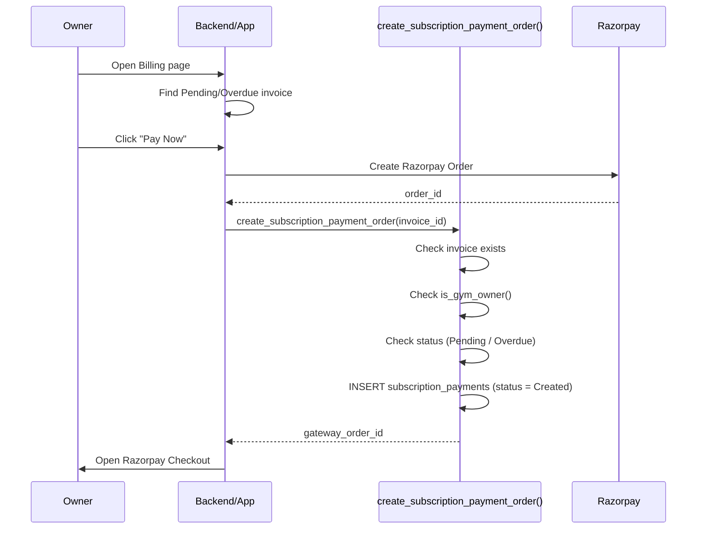

### `create_subscription_payment_order()` internal flow

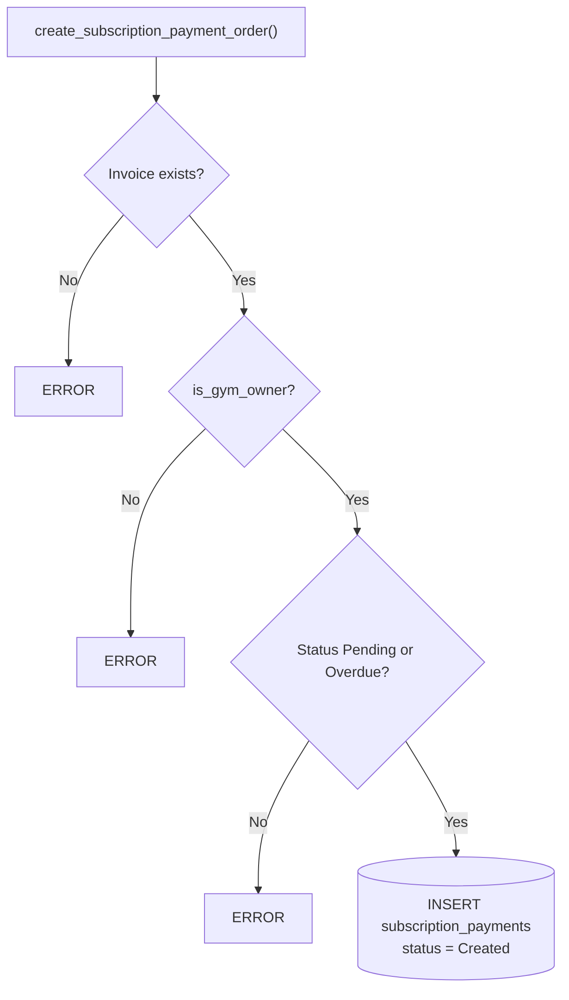

---

## 9. Razorpay payment capture → webhook → RPC chain

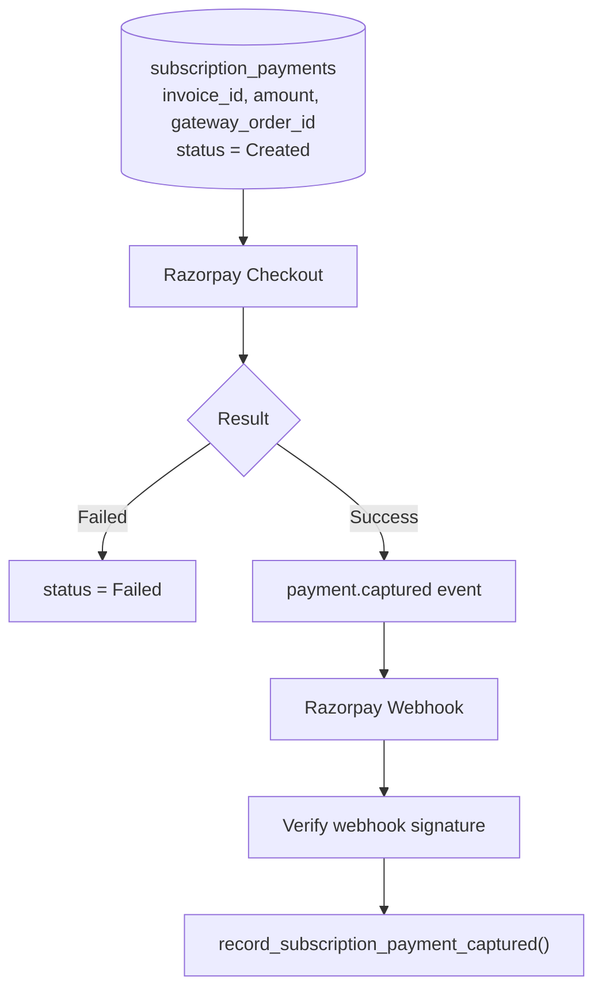

### `record_subscription_payment_captured()`

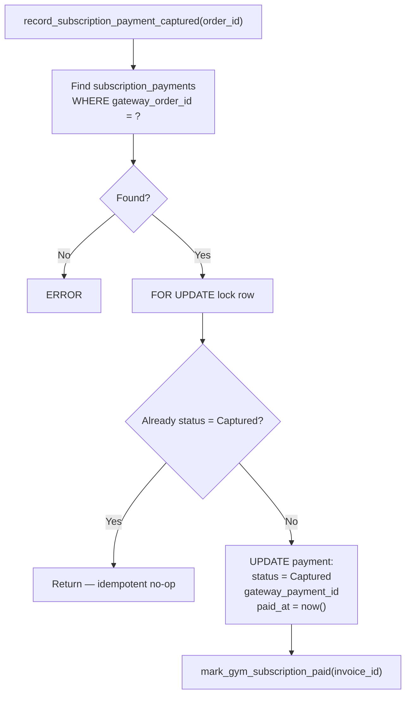

Its job in one line: **Razorpay order → find TrackVim payment → mark payment Captured → find TrackVim invoice → mark invoice Paid → update gym billing_status.** It's the bridge between the external payment gateway and TrackVim's internal billing state.

### `mark_gym_subscription_paid()` — now updates both invoice and gym billing status

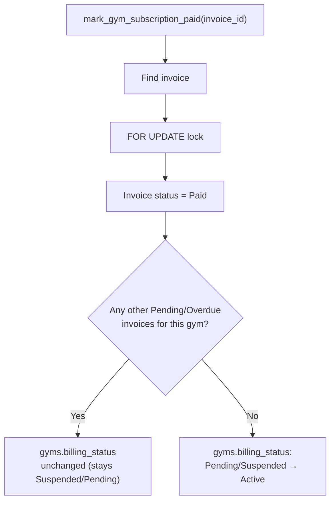

> Paying **one** overdue invoice does not blindly reactivate the gym — the function checks whether anything else is unpaid first. Payment now changes **both** the invoice row (`Pending/Overdue → Paid`) and the gym row (`billing_status → Active`) in the same operation.

---

## 10. Overdue & suspension flow (daily cron, 04:00)

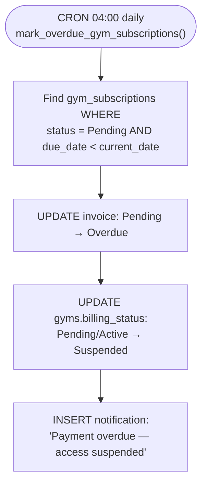

### Recovery after suspension

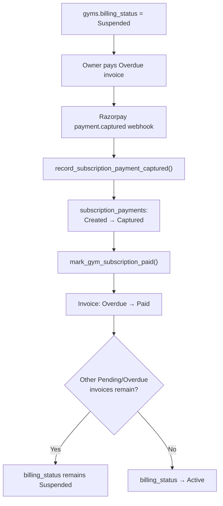

---

## 11. Plan change flow

The owner changes their subscription plan from Settings. The **current invoice is recalculated in place** rather than left untouched — the plan change is reflected immediately on the active Pending invoice via proration. `billing_status` itself is not touched by a plan change — only `current_plan_id` and the locked invoice.

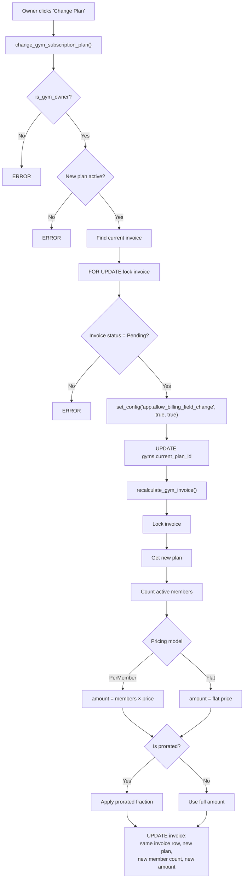

### Why this differs from a simple plan swap

- The RPC now **requires** a Pending invoice to exist and locks it (`FOR UPDATE`) before touching anything — an Overdue or already-Paid invoice blocks the change with an error, rather than silently changing the plan for next month only.
- `recalculate_gym_invoice()` re-derives the amount from scratch (fresh member count + new plan price), then applies proration if the plan's billing model is prorated — it does **not** just multiply the difference.
- The **same invoice row** is updated (not a new one created), so the owner sees one clean Pending invoice reflecting the new plan.

### Why `set_config()` is involved

The protection trigger `gyms_protect_billing_fields` runs on every `UPDATE gyms` and blocks direct changes to `billing_start_date`, `current_plan_id`, and now `billing_status`. A normal client-side update would be rejected:

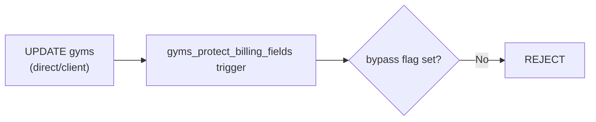

The trusted RPC sets a transaction-local flag first (third argument `true` = local to the transaction, auto-clears at commit):

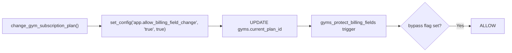

---

## 12. Cancellation & reactivation RPCs

### `cancel_gym_billing()`

Cancels only the outstanding **Pending** invoice — a already-**Paid** invoice (e.g. this month's) is left untouched — and moves the gym to `billing_status = Cancelled`. `current_plan_id` is deliberately kept so the owner's prior plan is on record.

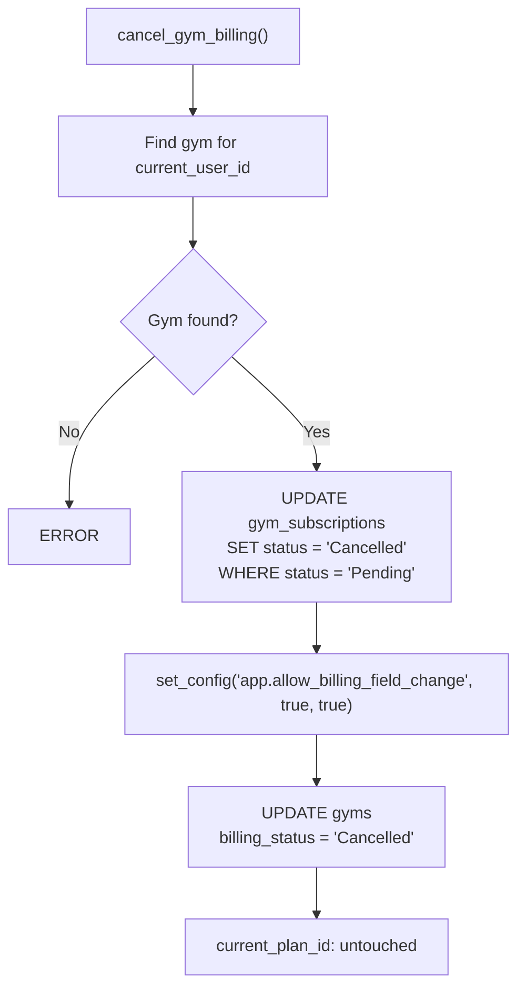

Example outcome:

```text
August    → Paid       (untouched)
September → Cancelled  (was Pending)
billing_status → Cancelled
current_plan_id → unchanged
```

### `reactivate_gym_subscription()`

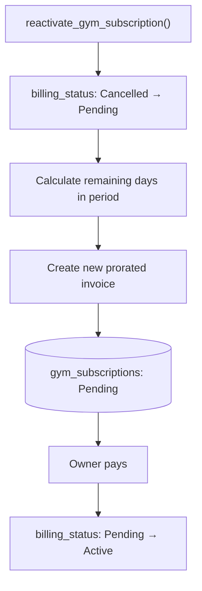

### `get_gym_billing_overview()` — now returns `billing_status`

This read-only RPC assembles the owner's full billing picture in one call: the gym row (including `billing_status` and `billing_start_date`), the current plan, the current Pending invoice (if any), and the most recent invoice regardless of status.

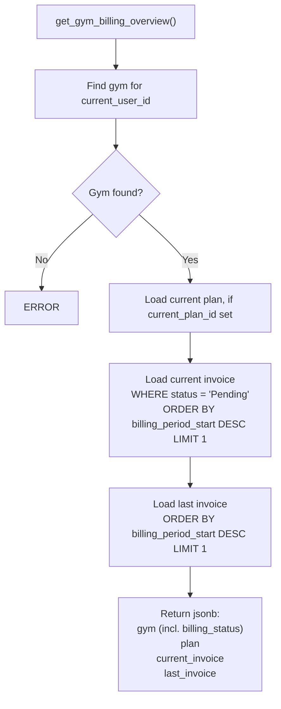

---

## 13. Trial extension (admin/support operation)

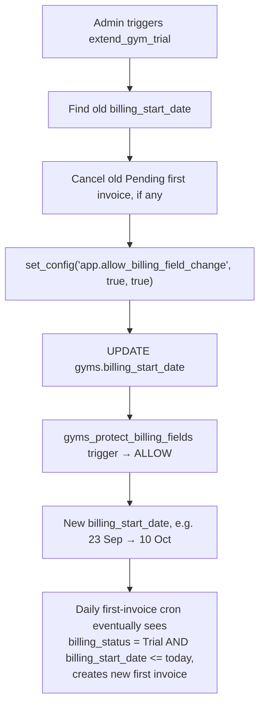

---

## 14. All triggers in the current design

### Trigger 1 — `gyms_set_billing_defaults`

- **Fires on:** `BEFORE INSERT` on `gyms`
- **Does:** sets `billing_start_date = signup + 1 month`, `current_plan_id = Basic` if NULL, and `billing_status = Trial`

```mermaid
flowchart LR
    A[INSERT gyms] --> B[BEFORE INSERT] --> C[gyms_set_billing_defaults] --> D[modify NEW row] --> E[INSERT continues]
```

### Trigger 2 — `gyms_protect_billing_fields`

- **Fires on:** `BEFORE UPDATE` on `gyms`
- **Protects:** `billing_start_date`, `current_plan_id`, `billing_status`
- **Bypassed only** by trusted RPCs via `set_config('app.allow_billing_field_change', 'true', true)`

```mermaid
flowchart LR
    A[UPDATE gyms] --> B[BEFORE UPDATE] --> C[gyms_protect_billing_fields]
    C --> D{bypass flag?}
    D -- false --> E[ERROR]
    D -- true --> F[ALLOW]
```

### Removed trigger — `gyms_generate_first_invoice_on_insert`

No longer exists. First-invoice creation moved from an insert-time trigger to the daily cron (`generate_first_gym_invoices()`), so gyms get a real free trial period before any invoice appears.

---

## 15. Complete RPC / function map

| Function                                 | Called by                        | When                             | Purpose                                                                         |
| ---------------------------------------- | -------------------------------- | -------------------------------- | ------------------------------------------------------------------------------- |
| `gyms_set_billing_defaults()`            | DB trigger                       | Gym INSERT                       | Set trial end, default plan, `billing_status = Trial`                           |
| `gyms_protect_billing_fields()`          | DB trigger                       | Gym UPDATE                       | Prevent direct changes to billing_start_date / current_plan_id / billing_status |
| `generate_first_gym_invoices()`          | Cron                             | Daily 02:30                      | Create first invoice for `Trial` gyms; flip `billing_status → Pending`          |
| `create_gym_invoice()`                   | First/monthly generator          | During invoice generation        | Actually create the invoice row                                                 |
| `generate_gym_subscription_invoices()`   | Cron                             | 1st of month, 03:00              | Create recurring invoices for `Active`/`Suspended` gyms                         |
| `create_subscription_payment_order()`    | Owner app                        | "Pay Now" click                  | Create Razorpay payment mapping                                                 |
| `record_subscription_payment_captured()` | Razorpay webhook                 | Payment captured                 | Capture payment + mark invoice Paid                                             |
| `mark_gym_subscription_paid()`           | Capture function                 | Successful payment               | Mark invoice Paid + update `billing_status → Active` if clear                   |
| `mark_overdue_gym_subscriptions()`       | Cron                             | Daily 04:00                      | Pending → Overdue + `billing_status → Suspended`                                |
| `change_gym_subscription_plan()`         | Owner app                        | Plan change                      | Change plan + recalc current invoice                                            |
| `recalculate_gym_invoice()`              | `change_gym_subscription_plan()` | During plan change               | Recompute amount/proration on locked invoice                                    |
| `cancel_gym_billing()`                   | Owner app / admin                | Owner cancels                    | Cancel Pending invoice, `billing_status → Cancelled`, keep `current_plan_id`    |
| `reactivate_gym_subscription()`          | Owner app / admin                | Owner returns after cancellation | `billing_status → Pending`, issue new prorated invoice                          |
| `get_gym_billing_overview()`             | Owner app                        | Billing page load                | Return gym + plan + current/last invoice, including `billing_status`            |
| `extend_gym_trial()`                     | Admin/backend                    | Trial extension                  | Push billing_start_date forward                                                 |

---

## 16. Master flow — everything together

```mermaid
flowchart TD
    subgraph Signup["Signup & Trial"]
        A[Gym signup] --> B[INSERT gyms]
        B --> C["BEFORE INSERT trigger:\ngyms_set_billing_defaults"]
        C --> D["Free trial — billing_status = Trial"]
    end

    subgraph FirstInvoice["First Invoice — Daily 02:30"]
        D --> E["generate_first_gym_invoices()"]
        E --> F{billing_start_date <= today\nAND no prior invoice?}
        F -- Yes --> G[Count members → get plan → calc amount + proration]
        G --> H["create_gym_invoice()"]
        H --> I["gym_subscriptions: Pending\nbilling_status: Trial → Pending"]
        I --> AA{Owner continues?}
        AA -- No --> AB["cancel_gym_billing()"]
        AB --> AC["billing_status → Cancelled\ncurrent_plan_id kept"]
        AC --> AD[Owner returns later]
        AD --> AE["reactivate_gym_subscription()"]
        AE --> AF["billing_status → Pending\nNew prorated invoice"]
    end

    subgraph Payment["Payment"]
        I --> J[Owner clicks Pay Now]
        J --> K["create_subscription_payment_order()"]
        K --> L[(subscription_payments: Created)]
        L --> M[Razorpay Checkout]
        M -->|captured| N[Webhook]
        N --> O["record_subscription_payment_captured()"]
        O --> P["mark_gym_subscription_paid()"]
        P --> Q{Other unpaid invoices?}
        Q -- No --> R["billing_status → Active"]
        Q -- Yes --> S["billing_status stays Suspended"]
    end

    subgraph Monthly["Monthly Recurring — 1st of month 03:00"]
        R --> T["generate_gym_subscription_invoices()"]
        T --> U["New Pending invoice each month\nbilling_status: Active → Pending"]
        U --> J
    end

    subgraph Overdue["Overdue — Daily 04:00"]
        U -->|due_date passed, unpaid| V["mark_overdue_gym_subscriptions()"]
        V --> W[Invoice: Pending → Overdue]
        W --> X["billing_status → Suspended"]
        X --> Y[Notification sent]
        Y --> J
    end

    subgraph Cancel["Cancellation (owner-initiated)"]
        R --> Z0["cancel_gym_billing()"]
        Z0 --> Z0b["billing_status → Cancelled\ncurrent_plan_id kept"]
    end

    subgraph PlanChange["Plan Change (owner-initiated, any time)"]
        Z1[Owner clicks Change Plan] --> Z2["change_gym_subscription_plan()"]
        Z2 --> Z3[Checks: is_gym_owner, plan active, invoice Pending + locked]
        Z3 --> Z4["set_config bypass"] --> Z5[UPDATE current_plan_id]
        Z5 --> Z6["recalculate_gym_invoice()"] --> Z7[Same invoice updated with new amount]
    end
```

---

## 17. Key takeaways

- **Billing state is now its own field.** `gyms.billing_status` (`Trial` / `Pending` / `Active` / `Suspended` / `Cancelled`) is separate from `gyms.status` (application/operational state) and from `gym_subscriptions.status` (per-invoice state). Query and index on the one that actually answers your question.
- **`current_plan_id` survives cancellation.** Cancelling billing never nulls out the plan — `Cancelled` is a distinct state, not the absence of a plan.
- **No insert-time invoice trigger anymore** — the first invoice is cron-driven, giving every gym a real 1-month trial before `billing_status` ever leaves `Trial`.
- **Three cron jobs drive the whole billing calendar:** first invoice (daily 02:30, targets `Trial` gyms), monthly recurring (1st @ 03:00, targets `Active`/`Suspended` gyms), overdue sweep (daily 04:00).
- **Two triggers only**, and both operate on `gyms`: one sets defaults (including `billing_status = Trial`) on insert, one protects billing fields — now including `billing_status` — on update.
- **`set_config()` with `is_local = true`** is the mechanism that lets trusted RPCs bypass the protection trigger for exactly one transaction.
- **Plan changes are no longer "fire and forget"** — they recalculate and update the _current_ Pending invoice in place (with proration), rather than leaving it untouched until the next billing cycle. Plan changes don't touch `billing_status`.
- **Paying an invoice never blindly reactivates a gym** — both `mark_gym_subscription_paid()` and the recovery-after-suspension path explicitly check for other unpaid invoices before moving `billing_status` to `Active`.
- **Cancellation → reactivation is a full loop**, not a dead end: `Active → Cancelled → Pending (reactivate) → Active (pay)`, with a fresh prorated invoice generated on reactivation rather than resuming old billing dates.
