# TrackVim — SaaS Billing System Documentation

This document explains the complete gym subscription billing flow: trial → first invoice → payment → monthly recurring → overdue/suspension → plan changes. It covers **which triggers fire automatically**, **which RPCs are called explicitly**, and **which crons run on a schedule**.

---

## 1. Mental model: Trigger vs RPC vs Cron

| Type        | Who calls it                                  | Example                                                          |
| ----------- | --------------------------------------------- | ---------------------------------------------------------------- |
| **Trigger** | Postgres, automatically, on a table event     | `gyms_set_billing_defaults` on `INSERT INTO gyms`                |
| **RPC**     | Application/backend, explicitly               | `change_gym_subscription_plan()` when owner clicks "Change Plan" |
| **Cron**    | `pg_cron` / Supabase scheduler, on a schedule | `generate_first_gym_invoices()` at 02:30 daily                   |

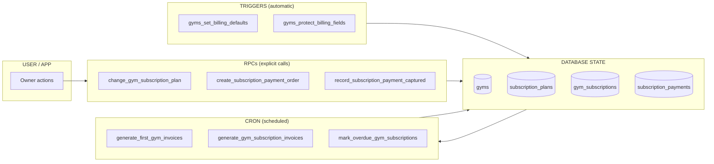

**Triggers protect/set data. RPCs perform business actions. Cron drives time-based billing.**

---

## 2. End-to-end lifecycle overview

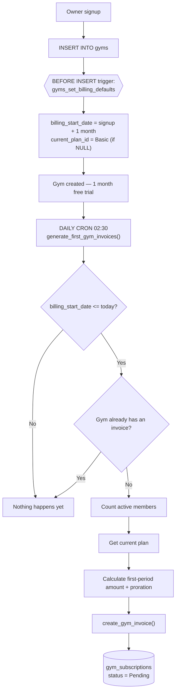

> **Key design change:** there is **no trigger** that creates the first invoice on gym insert anymore. The old trigger `gyms_generate_first_invoice_on_insert` was removed. Instead: `INSERT gym → trial → daily cron → first invoice`.

---

## 3. Trial flow — owner inactivity, cancellation & reactivation

This traces the trial period through to its two possible outcomes: the owner pays and the gym goes live, or the owner never engages and the invoice/gym eventually gets manually shut down — with a path back in later.

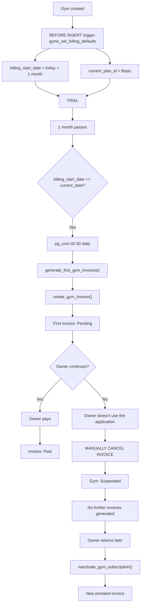

### Notes on this path

- The trial itself needs **no invoice** — `gyms_set_billing_defaults` only stamps `billing_start_date` and the default `Basic` plan; the daily cron is what turns trial-end into an actual Pending invoice.
- If the owner simply goes quiet, TrackVim doesn't auto-generate invoices forever against a dead gym — the first Pending invoice is **manually cancelled** (support/admin action) rather than left to age into Overdue indefinitely, and the gym is marked **Suspended** directly.
- Once suspended this way, the monthly cron (`generate_gym_subscription_invoices()`) has nothing to act on — no invoice history means no recurring billing starts.
- Coming back is a distinct RPC, `reactivate_gym_subscription()`, not a resumption of the original trial: it issues a **new prorated invoice** reflecting the current plan and today's date, rather than resurrecting the old billing_start_date.

---

## 4. First invoice generation (daily cron, 02:30)

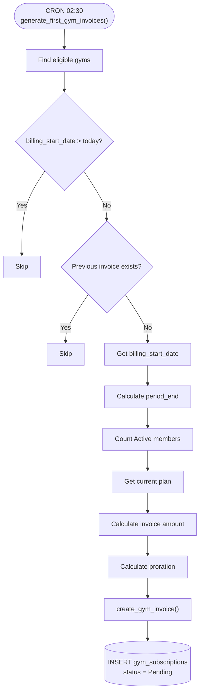

---

## 5. Monthly recurring invoices (cron, 1st of month 03:00)

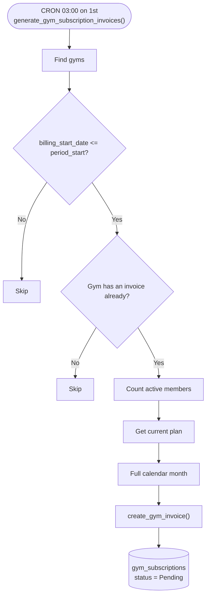

**Division of responsibility:**

- `generate_first_gym_invoices()` → the **first** invoice only
- `generate_gym_subscription_invoices()` → **all future** monthly invoices

Both ultimately call the shared `create_gym_invoice()` RPC, which is the central invoice-creation function (takes the plan + member snapshot and creates the invoice row).

---

## 6. Owner pays: Billing → Pay Now → Razorpay

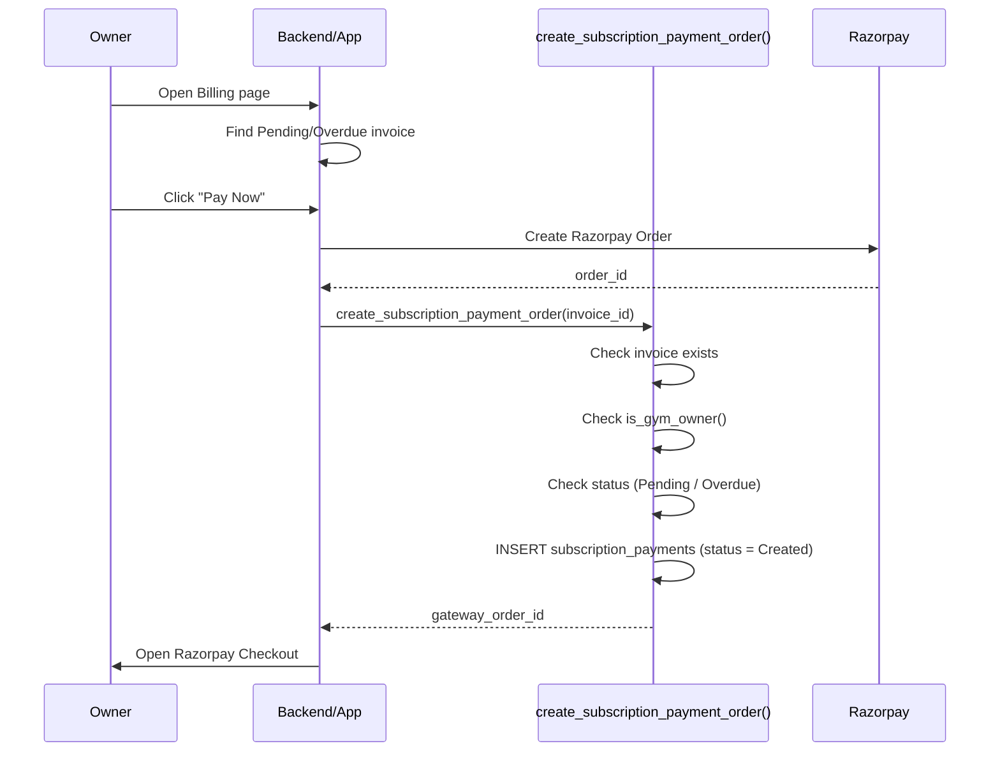

### `create_subscription_payment_order()` internal flow

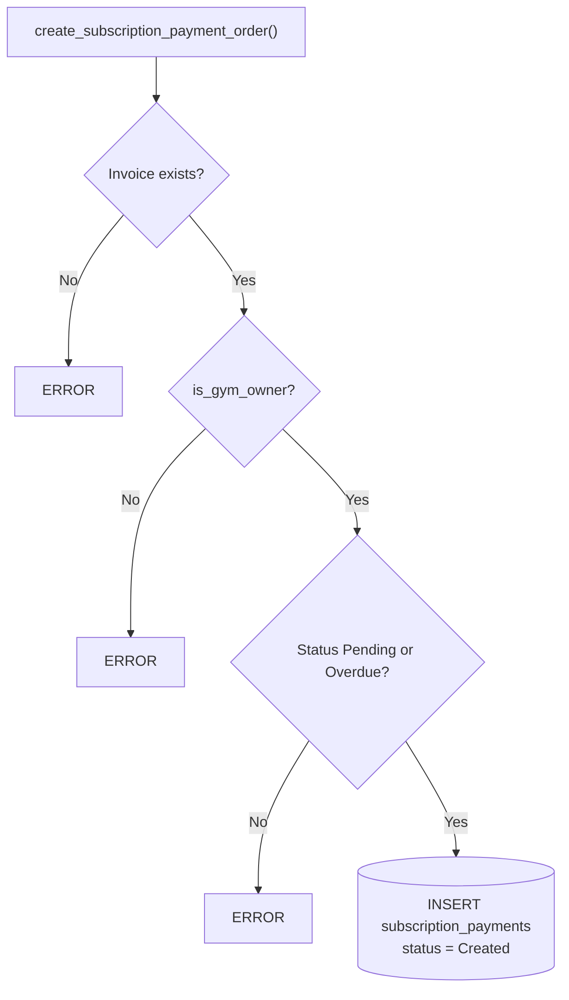

---

## 7. Razorpay payment capture → webhook → RPC chain

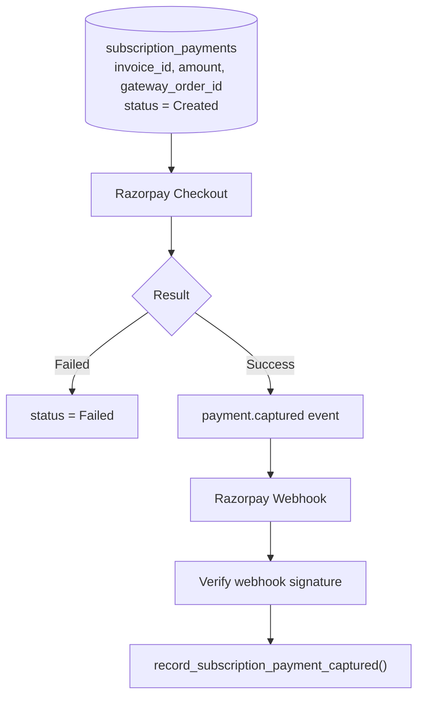

### `record_subscription_payment_captured()`

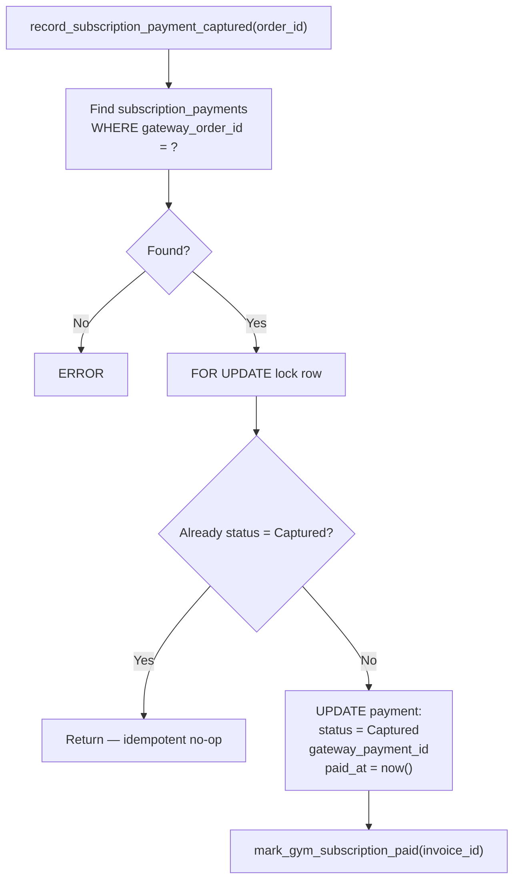

Its job in one line: **Razorpay order → find TrackVim payment → mark payment Captured → find TrackVim invoice → mark invoice Paid.** It's the bridge between the external payment gateway and TrackVim's internal billing state.

### `mark_gym_subscription_paid()`

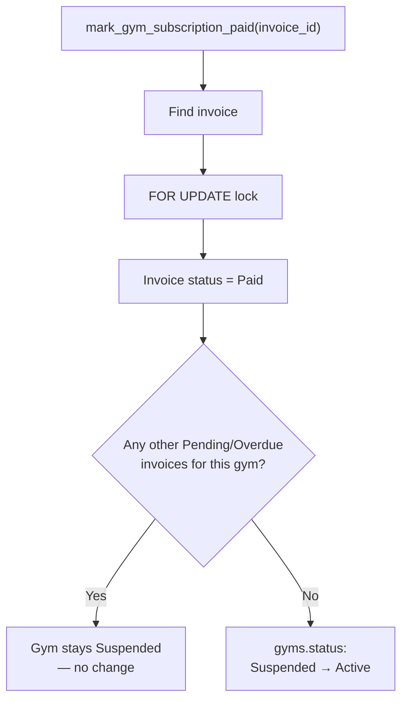

> Paying **one** overdue invoice does not blindly reactivate the gym — the function checks whether anything else is unpaid first.

---

## 8. Overdue & suspension flow (daily cron, 04:00)

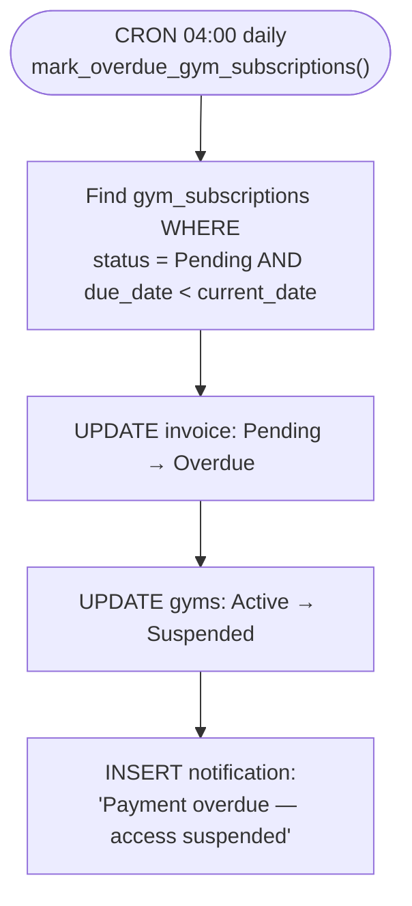

### Recovery after suspension

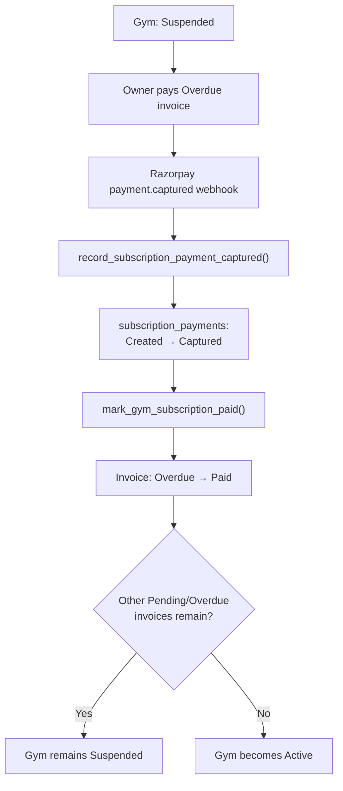

---

## 9. Plan change flow (updated)

The owner changes their subscription plan from Settings. Unlike earlier revisions of this flow, the **current invoice is now recalculated in place** rather than left untouched — the plan change is reflected immediately on the active Pending invoice via proration.

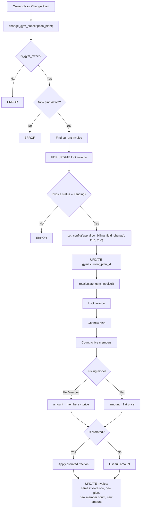

### Why this differs from a simple plan swap

- The RPC now **requires** a Pending invoice to exist and locks it (`FOR UPDATE`) before touching anything — an Overdue or already-Paid invoice blocks the change with an error, rather than silently changing the plan for next month only.
- `recalculate_gym_invoice()` re-derives the amount from scratch (fresh member count + new plan price), then applies proration if the plan's billing model is prorated — it does **not** just multiply the difference.
- The **same invoice row** is updated (not a new one created), so the owner sees one clean Pending invoice reflecting the new plan.

### Why `set_config()` is involved

The protection trigger `gyms_protect_billing_fields` runs on every `UPDATE gyms` and blocks direct changes to `billing_start_date` and `current_plan_id`. A normal client-side update would be rejected:

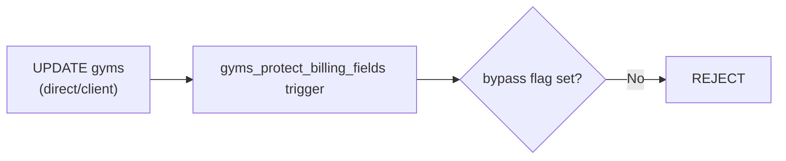

The trusted RPC sets a transaction-local flag first (third argument `true` = local to the transaction, auto-clears at commit):

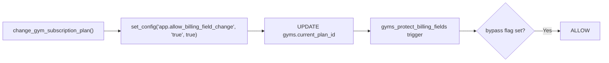

---

## 10. Trial extension (admin/support operation)

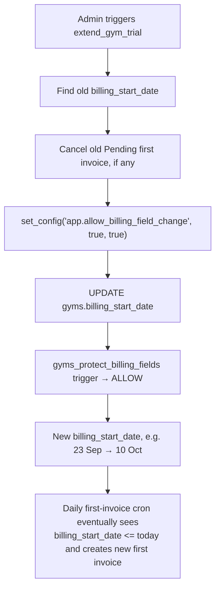

---

## 11. All triggers in the current design

### Trigger 1 — `gyms_set_billing_defaults`

- **Fires on:** `BEFORE INSERT` on `gyms`
- **Does:** sets `billing_start_date = signup + 1 month`, and `current_plan_id = Basic` if NULL

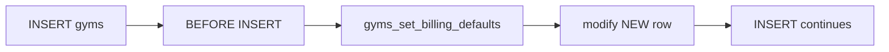

### Trigger 2 — `gyms_protect_billing_fields`

- **Fires on:** `BEFORE UPDATE` on `gyms`
- **Protects:** `billing_start_date`, `current_plan_id`
- **Bypassed only** by trusted RPCs via `set_config('app.allow_billing_field_change', 'true', true)`

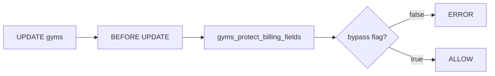

### Removed trigger — `gyms_generate_first_invoice_on_insert`

No longer exists. First-invoice creation moved from an insert-time trigger to the daily cron (`generate_first_gym_invoices()`), so gyms get a real free trial period before any invoice appears.

---

## 12. Complete RPC / function map

| Function                                 | Called by                        | When                                               | Purpose                                          |
| ---------------------------------------- | -------------------------------- | -------------------------------------------------- | ------------------------------------------------ |
| `gyms_set_billing_defaults()`            | DB trigger                       | Gym INSERT                                         | Set trial end + default plan                     |
| `gyms_protect_billing_fields()`          | DB trigger                       | Gym UPDATE                                         | Prevent direct billing field changes             |
| `generate_first_gym_invoices()`          | Cron                             | Daily 02:30                                        | Create first invoice                             |
| `create_gym_invoice()`                   | First/monthly generator          | During invoice generation                          | Actually create the invoice row                  |
| `generate_gym_subscription_invoices()`   | Cron                             | 1st of month, 03:00                                | Create recurring invoices                        |
| `create_subscription_payment_order()`    | Owner app                        | "Pay Now" click                                    | Create Razorpay payment mapping                  |
| `record_subscription_payment_captured()` | Razorpay webhook                 | Payment captured                                   | Capture payment + mark invoice Paid              |
| `mark_gym_subscription_paid()`           | Capture function                 | Successful payment                                 | Mark invoice Paid + restore gym if clear         |
| `mark_overdue_gym_subscriptions()`       | Cron                             | Daily 04:00                                        | Pending → Overdue + suspend gym                  |
| `change_gym_subscription_plan()`         | Owner app                        | Plan change                                        | Change plan + recalc current invoice             |
| `recalculate_gym_invoice()`              | `change_gym_subscription_plan()` | During plan change                                 | Recompute amount/proration on locked invoice     |
| `extend_gym_trial()`                     | Admin/backend                    | Trial extension                                    | Push billing_start_date forward                  |
| `reactivate_gym_subscription()`          | Admin/backend                    | Owner returns after inactivity-driven cancellation | Issue new prorated invoice, lift suspension path |

---

## 13. Master flow — everything together

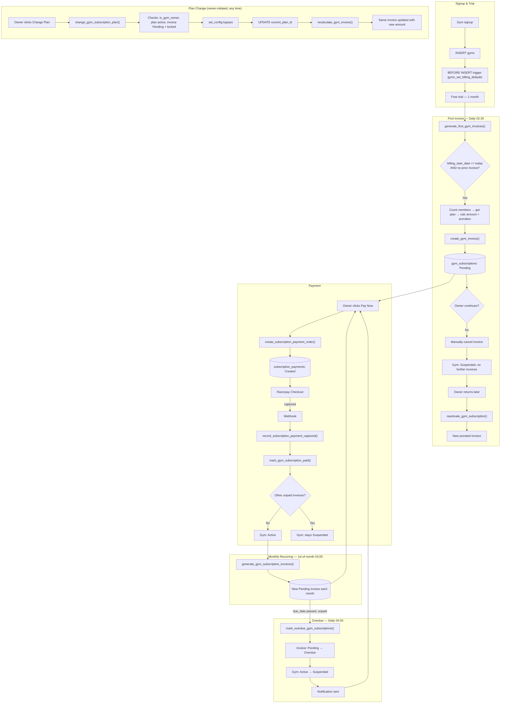

---

## 14. Key takeaways

- **No insert-time invoice trigger anymore** — the first invoice is cron-driven, giving every gym a real 1-month trial.
- **Three cron jobs drive the whole billing calendar:** first invoice (daily 02:30), monthly recurring (1st @ 03:00), overdue sweep (daily 04:00).
- **Two triggers only**, and both operate on `gyms`: one sets defaults on insert, one protects billing fields on update.
- **`set_config()` with `is_local = true`** is the mechanism that lets trusted RPCs bypass the protection trigger for exactly one transaction.
- **Plan changes are no longer "fire and forget"** — they recalculate and update the _current_ Pending invoice in place (with proration), rather than leaving it untouched until the next billing cycle.
- **Paying an invoice never blindly reactivates a gym** — both `mark_gym_subscription_paid()` and the recovery-after-suspension path explicitly check for other unpaid invoices first.
