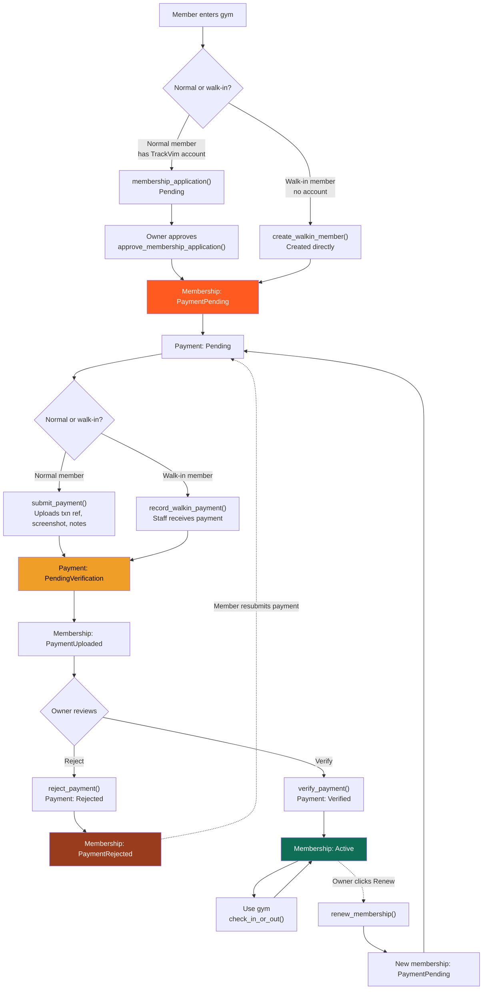
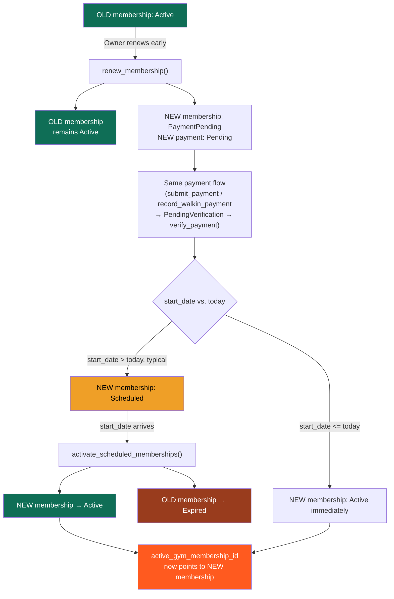

# TrackVim membership lifecycle

Full state machine covering enrollment, payment verification, rejection retry, and renewal — normal members and walk-ins both flow through the same payment pipeline.

## Legend

- **Solid arrows** — the forward, one-time path a payment/application takes on its first attempt.
- **Dashed arrows** — retry loops: a rejected payment goes back into `Payment: Pending`, and an active membership loops back through the same pipeline on renewal.
- Both **normal members** and **walk-ins** merge into identical downstream states (`PaymentPending`, `PendingVerification`, `Active`) — the only difference is _who_ triggers the transition (member vs. staff/owner).
- `check_in_or_out()` doesn't change membership state — an active member can check in/out indefinitely until renewal is triggered.

## Key functions

| Function                           | Triggered by  | Effect                                            |
| ---------------------------------- | ------------- | ------------------------------------------------- |
| `membership_application()`         | Normal member | Creates application in `Pending`                  |
| `create_walkin_member()`           | Staff         | Creates member directly, skips application        |
| `approve_membership_application()` | Owner         | Moves application → `PaymentPending`              |
| `submit_payment()`                 | Normal member | Uploads proof → `PendingVerification`             |
| `record_walkin_payment()`          | Staff         | Records payment → `PendingVerification`           |
| `verify_payment()`                 | Owner         | Payment `Verified` → Membership `Active`          |
| `reject_payment()`                 | Owner         | Payment `Rejected` → Membership `PaymentRejected` |
| `check_in_or_out()`                | Member/staff  | Attendance only, no state change                  |
| `renew_membership()`               | Owner         | Spins up new `PaymentPending` cycle               |

 
## 3. Early renewal
 
The key idea: renewing doesn't touch the old membership. It creates a second membership row that runs the *same* payment flow, then sits as `Scheduled` until its start date, at which point a cron-style job flips both records over.
 

 
---
 